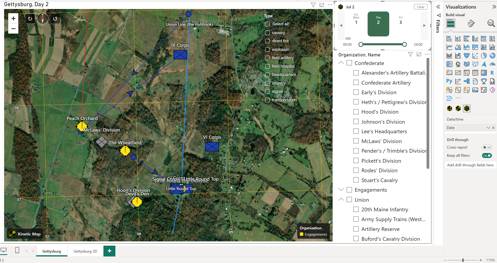
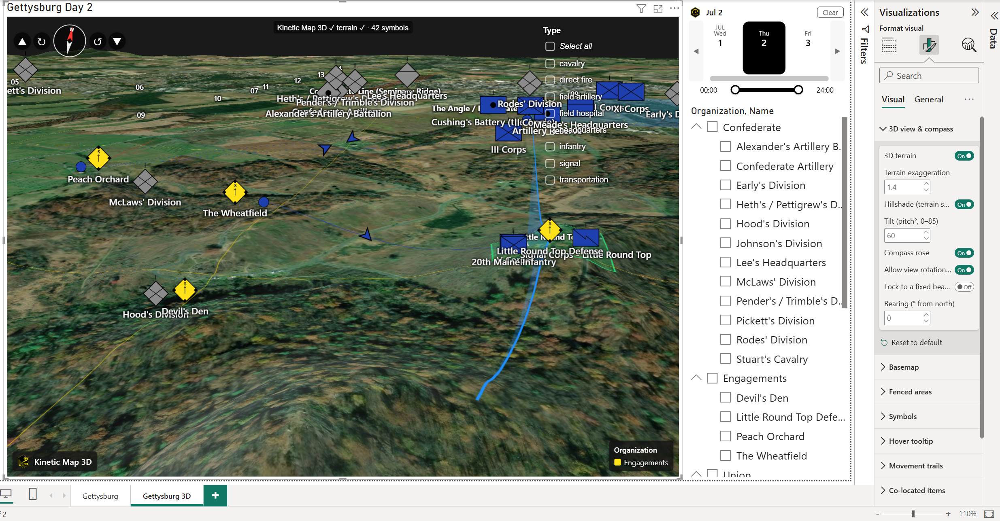

# Kinetic Suite for Power BI

A suite of Power BI custom visuals for operational and geospatial data built around the MIL-STD-2525C symbology standard.

| Visual | Description |
|---|---|
| **Kinetic Map** | Plot unit and event symbols on a satellite basemap (MGRS or lat/long) |
| **Kinetic Map 3D** | Same as Kinetic Map, rendered on a photorealistic 3D globe |
| **Kinetic Timeline** | Scrollable day-strip slicer; pairs with either map visual to filter by date and time |

---

## See it in action

The screenshots below are the included **[Gettysburg.pbix](samples/Gettysburg.pbix)** sample — the second day of the Battle of Gettysburg (July 2, 1863), with every unit and engagement plotted from MGRS grid references and filtered to a single day by the Kinetic Timeline. Open the sample and you have this report in minutes.

**Kinetic Map (2D)** — MIL-STD-2525C symbols on satellite imagery, with an MGRS grid overlay, movement trails, an on-map category filter, and the day-strip timeline driving the date:



**Kinetic Map 3D** — the same data and symbols draped over a photorealistic 3D globe with terrain, hillshade, and a compass for view rotation:



---

## Key features

### Kinetic Map (2D & 3D)

- **Recreate a battlefield or Common Operating Picture (COP)** — a full toolset to dynamically display live operational data or reconstruct a historical engagement.
- **MIL-STD-2525C symbology** — render the full 2525C unit and event symbol set, auto-colored by affiliation (friendly / hostile / neutral / unknown).
- **MGRS or lat/long plotting** — accepts Military Grid Reference System coordinates (or decimal lat/long) for both unit and event placement.
- **Dynamic MGRS grid overlays** — a zoom-adaptive grid (GZD → 100 km → 10 km → 1 km → 100 m) drawn live over the map.
- **Movement trails** — connect a unit's positions over time to visualize maneuver and advance.
- **Six map styles** — satellite, hybrid, street, topographic, light-gray, and NatGeo basemaps (3D adds 3D terrain + hillshade).
- **Area overlays / geofences** — define fenced areas from inline GeoJSON or a URL and draw them on the map.
- **Built-in overlay filter** — an on-map category panel that filters the map's own symbols and the rest of the report page.
- **Co-located stacking** — automatically spreads items sharing the same point so nothing hides behind another symbol, keeping the view clean.
- **Custom hover-over information** — choose exactly which fields appear in the tooltip when you hover a symbol.
- **Deep customization** — fine control over spacing, sizes, label gaps, and offsets across every element.
- **3D extras** — a photorealistic 3D globe with terrain exaggeration, hillshade, a compass rose, and free view rotation.

### Kinetic Timeline

- **Day-strip date selection** — scroll to any date and **ctrl + click** or **click-drag** to select single days or a contiguous range.
- **Within-day time filter** — drag a time-of-day slider to scope fast-moving events down to the hour inside a single day.
- **Historical-date support** — handles dates earlier than standardized time zones, so you can faithfully recreate historical events (the 1863 Gettysburg sample relies on this).
- **Customizable coloring** — many pre-made color schemes plus custom color overrides.
- **Page-wide sync** — emits a standard Power BI filter that scopes every visual on the page, including both Kinetic maps.

---

## Download

The latest release is **v1.3.1.1**. Download the `.pbiviz` files from the [Releases](../../releases/latest) page and import them into Power BI via **Insert → Get more visuals → Import a visual from a file**.

| Visual | Download |
|---|---|
| Kinetic Map | [KineticMap-1.3.1.1.pbiviz](../../releases/download/v1.3.1.1/KineticMap-1.3.1.1.pbiviz) |
| Kinetic Map 3D | [KineticMap3D-1.3.1.1.pbiviz](../../releases/download/v1.3.1.1/KineticMap3D-1.3.1.1.pbiviz) |
| Kinetic Timeline | [KineticTimeline-1.3.1.1.pbiviz](../../releases/download/v1.3.1.1/KineticTimeline-1.3.1.1.pbiviz) |

---

## Sample files

The [`samples/`](samples/) folder contains a ready-to-open Power BI report **and** the raw dataset behind it — so you can explore the finished visuals or rebuild them from scratch.

| File | Description |
|---|---|
| [Gettysburg.pbix](samples/Gettysburg.pbix) | Battle of Gettysburg (July 1–3, 1863) — unit positions and engagements plotted via MGRS, with the Kinetic Timeline for day-by-day filtering. Built with the current **v1.3.1.1** visuals. |
| [gettysburg-sample.xlsx](samples/gettysburg-sample.xlsx) | The **raw source data** for the report above — one row per unit/event with MGRS, symbol type, affiliation, organization, color, and date/time. Load it into Power BI to build your own report, or review it to see the expected column layout. |

---

## Kinetic Map — field reference

### Data field wells

| Field well | Type | Description |
|---|---|---|
| **Name** | Text | Unit or event label shown beneath the symbol |
| **MGRS** | Text | Military Grid Reference System string (e.g. `16SBK1234567890`). Takes priority over Lat/Lon when both are bound. |
| **Lat** | Decimal | Latitude in decimal degrees |
| **Lon** | Decimal | Longitude in decimal degrees |
| **Symbol Type** | Text | A friendly **alias** (e.g. `infantry`) or a raw MIL-STD-2525C SIDC string. See [Symbol aliases](#symbol-aliases) and [Symbol codes](#symbol-codes-sidc) below. |
| **Affiliation** | Text | `F` Friendly · `H` Hostile · `N` Neutral · `U` Unknown |
| **Organization** | Text | Groups units for color-by-organization mode |
| **Color** | Text | Hex (`#FF6600`) or CSS color name to override the symbol fill |
| **Date** | Date/Time | Enables movement trails and timeline filtering |
| **Filter** | Any | Category field exposed in the filter overlay panel *(paid)* |
| **Priority** | Number | Z-order for overlapping symbols — higher number renders on top |

### Symbol aliases

You rarely need to type a raw 15-character SIDC. The **Symbol Type** field accepts a plain-English **alias** and Kinetic resolves it to the correct MIL-STD-2525C symbol, with a sensible default affiliation you can override via the **Affiliation** or **Color** fields. Aliases are **case-insensitive** and tolerate extra spaces, and most symbols answer to several synonyms.

There are three ways to set a symbol:

1. **Friendly alias** — e.g. `infantry`, `armor`, `field artillery`, `helicopter`, `ied`, `sniper`. Over **230 unit aliases** and **600 event aliases** are recognized.
2. **Raw 2525C SIDC** — any valid 15-character code, e.g. `SFGPUCI---E----` (see [Symbol codes](#symbol-codes-sidc) below).
3. **Custom glyph** — `CUSTOM:<glyph>` for shapes 2525C has no clean symbol for: `CUSTOM:building`, plus `bug` / `rodent` / `bird` / `reptile` for infestations.

#### Free vs. paid aliases

The **free tier** renders a core set of ~30 symbols — listed below — at full fidelity. Every alias/synonym of a free symbol works without a license. The **full library** (~340 symbols, every other alias) requires a Kinetic license; until then a locked symbol renders as a neutral grey dot in place of its glyph. Aliases are still *accepted* when unlicensed — only the paid glyph is withheld — so a report authored with a license degrades gracefully rather than breaking.

**Free unit symbols**

| Symbol | Aliases you can type |
|---|---|
| Infantry | `infantry` |
| Armor | `armor`, `armour` |
| Field artillery | `field artillery`, `artillery`, `arty`, `fa` |
| Engineer | `engineer`, `engineers` |
| Aviation (rotary wing) | `aviation`, `rotary wing`, `aviation rotary wing` |
| Headquarters / command post | `headquarters`, `hq`, `command post`, `hq element`, `headquarters element` |
| Medical | `medical`, `medic`, `med` |
| Transportation | `transport`, `transportation` |
| CBRN / chemical | `cbrn`, `chemical`, `nbc` |
| Electronic warfare | `electronic warfare`, `ew unit` |

**Free event symbols**

| Symbol | Aliases you can type |
|---|---|
| Explosion | `explosion`, `blast`, `detonation` |
| IED | `ied`, `ied detonation`, `ied emplacement` |
| Direct fire / small arms | `direct fire`, `small arms`, `sniper`, `sniping`, `firefight`, `contact`, `engagement` |
| Poisoning (CBRN) | `poisoning`, `cbrn`, `chemical` |
| Minefield | `mine`, `minefield`, `mine laying` |
| Land mine | `land mine`, `land mines` |
| PSYOP | `psyop`, `psychological operations`, `miso` |
| UAV / drone | `uav`, `uas`, `drone` |
| Electronic warfare | `electronic warfare`, `ew` |
| Biological event | `biological`, `bio`, `bioagent`, `biological agent`, `biological release`, `biological attack`, `bioweapon` |
| Chemical release | `chemical release`, `chemical attack`, `chemical weapon` |
| Nuclear detonation | `nuclear detonation`, `ground zero`, `nuclear strike` |
| Civil disturbance | `demonstration`, `riot`, `protest`, `civil disturbance`, `mass gathering`, `unrest` |
| Field hospital | `hospital`, `field hospital`, `clinic`, `medical treatment facility`, `health department facility` |
| SAM launcher | `sam launcher`, `surface-to-air missile`, `air defense missile launcher` |
| Rifle | `rifle` |
| Tank | `tank`, `main battle tank`, `mbt` |
| Car | `car`, `automobile` |
| Military aircraft | `military aircraft`, `aircraft` |
| Inspection gate | `gate`, `base gate`, `vehicle inspection`, `traffic inspection facility` |
| Building (custom glyph) | `building`, `structure`, `house`, `generic building`, `manmade structure` |

Anything outside this list — the rest of the ~340-symbol library — is a paid symbol. See [Licensing](#licensing).

### Symbol codes (SIDC)

Kinetic Map uses the **MIL-STD-2525C** Symbol Identification Code (SIDC) — a 15-character string that encodes the symbol's scheme, affiliation, category, function, and modifiers.

**Structure:**

```
Position:  1    2    3    4    5-6   7-10   11-12  13-14  15
           |    |    |    |    |     |      |      |      |
           S    F    G    P    U C   ------  --    --     -
           ^    ^    ^    ^    ^ ^
           |    |    |    |    | Echelon
           |    |    |    |    Status
           |    |    |    Function ID (4 chars, pos 7-10)
           |    |    Category
           |    Affiliation
           Scheme
```

**Position 1 — Coding scheme**

| Code | Scheme |
|---|---|
| `S` | Warfighting |
| `I` | Intelligence |
| `O` | Operations/orders |
| `E` | Emergency management |

**Position 2 — Affiliation** (also drives frame color)

| Code | Affiliation | Frame color |
|---|---|---|
| `F` or `A` | Friendly / Assumed friendly | Blue |
| `H` or `S` | Hostile / Suspect | Red |
| `N` | Neutral | Green |
| `U` or `P` | Unknown / Pending | Yellow |

**Position 3 — Category (battle dimension)**

| Code | Category |
|---|---|
| `P` | Space |
| `A` | Air |
| `G` | Ground |
| `S` | Sea surface |
| `U` | Subsurface |
| `F` | Special operations forces (SOF) |

**Position 4 — Status**

| Code | Status |
|---|---|
| `P` | Present (solid frame) |
| `A` | Anticipated / Planned (dashed frame) |

**Positions 5–6 — Function ID (first two characters)**

Common ground unit codes:

| SIDC prefix (pos 1–6) | Unit type |
|---|---|
| `SFGP**` | Infantry |
| `SFGPA*` | Airborne infantry |
| `SFGPE*` | Mechanized infantry |
| `SFGPD*` | Armor / tank |
| `SFGPF*` | Airborne |
| `SFGPC*` | Cavalry |
| `SFGPCA` | Armored cavalry |
| `SFGX**` | Task force (no function) |
| `SFAPE*` | Fixed-wing aircraft |
| `SFAPM*` | Rotary-wing (helicopter) |
| `SFAP**` | Aviation |
| `SHGP**` | Hostile ground unit (infantry) |
| `SNGP**` | Neutral ground unit |
| `SUGP**` | Unknown ground unit |

**Positions 11–12 — Echelon**

| Code | Echelon |
|---|---|
| `--` | None |
| `A-` | Team / crew |
| `B-` | Squad |
| `C-` | Section |
| `D-` | Platoon / detachment |
| `E-` | Company / battery / troop |
| `F-` | Battalion / squadron |
| `G-` | Regiment / group |
| `H-` | Brigade |
| `I-` | Division |
| `J-` | Corps / MEF |
| `K-` | Army |
| `L-` | Army group / front |
| `M-` | Region |
| `N-` | Command |

**Example SIDCs**

| SIDC | Description |
|---|---|
| `SFGPUCI---E----` | Friendly ground infantry company |
| `SFGPUCF---F----` | Friendly ground infantry battalion |
| `SFGPUCF---G----` | Friendly ground infantry regiment |
| `SFGPUCD---E----` | Friendly armored company |
| `SFGPUCD---F----` | Friendly armor battalion |
| `SFAPMFQ---****-` | Friendly helicopter (attack) |
| `SHGPUCI---E----` | Hostile infantry company |
| `SHGPUCD---F----` | Hostile armor battalion |
| `SUGPUCI--------` | Unknown infantry unit |

**Minimal working SIDC**

If you only need a symbol to appear without a specific type, use a 15-character string padded with `-`:

```
SFGP-----------    <- Friendly ground (generic)
SFAP-----------    <- Friendly air (generic)
SHGP-----------    <- Hostile ground (generic)
```

---

## Kinetic Timeline — field reference

### Data field wells

| Field well | Type | Description |
|---|---|---|
| **Date** | Date/Time | The column to filter on. Bind the same column as the Kinetic Map's Date field to keep both visuals synchronized. |

### Key settings (Format pane)

| Card | Setting | Description |
|---|---|---|
| Timeline | Fit to data | Anchors the initial view to the earliest date in the dataset instead of today |
| Timeline | Day width | Width of each day cell in pixels |
| Time of Day | Enabled | Shows the within-day hour range slider when a single day is selected *(paid)* |
| Colors | Scheme | Choose from High Contrast (free), Steel, Forest, Slate, Earth, or military branch themes *(paid)* |
| License | License Key | Enter your `KIN-XXXX-XXXX-XXXX-XXXX` key to unlock paid features |

---

## Licensing

Free features are available without a license key. Paid features — movement trails, MGRS grid, filter overlay, custom basemaps, time-of-day filtering, and color themes — require a Kinetic license.

Get a license at **[license.prosperemus.com/pricing](https://license.prosperemus.com/pricing)**.

---

## Support

- Kinetic Map: [prosperemus.com/kinetic-map/support/](https://prosperemus.com/kinetic-map/support/)
- Kinetic Timeline: [prosperemus.com/kinetic-timeline/support/](https://prosperemus.com/kinetic-timeline/support/)
- Email: [support@prosperemus.com](mailto:support@prosperemus.com)
